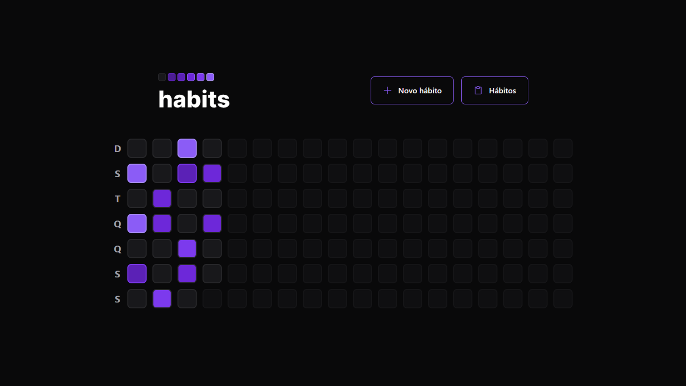
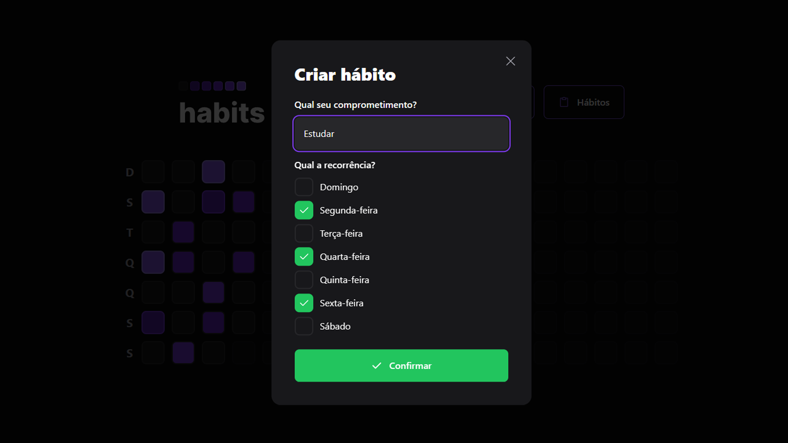

<h1 align="center">Habits</h1>

  

    
  

  

   
  
  

    
  

  

   

<h1 align="center">:sparkles: Tecnologias</h1>

Esse projeto foi desenvolvido com</h1>
 

<a href="https://pt-br.reactjs.org/">ReactJs</a>

<a href="https://tailwindcss.com/">Tailwindcss</a>

<a href="https://www.typescriptlang.org/">Typescript</a>

<a href="https://www.radix-ui.com/">Radix UI</a>

 

<h1 align="center">:computer: Sobre o Projeto</h1>

Aplicação feita com ReactJs (frontend) e NodeJs (backend), em que consiste a criação de hábitos como se fosse uma ToDo List. O fluxo do projeto imita o fluxo de commits do Github e esses dados serão cadastrados em um banco SQL (MySql com Prisma).

 

<h1 align="center">:rocket: Executando o Projeto</h1>

Comece clonando o repositório para sua máquina, usando

<pre><strong>$ git clone https://github.com/marlleyck/habits-client</strong></pre>

Após isso, vá até a pasta do projeto

<pre><strong>$ cd habits-client</strong></pre>

Instale todas as dependências usando o seu gerenciador de pacotes preferido

<pre><strong>$ npm install</strong></pre>

ou

<pre><strong>$ yarn</strong></pre>

 

Por fim, basta iniciar o projeto, usando

<pre><strong>$ npm run dev</strong></pre>

ou

<pre><strong>$ yarn dev</strong></pre>

Feito! O projeto está pronto para ser utilizado!

